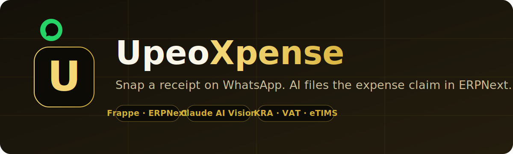
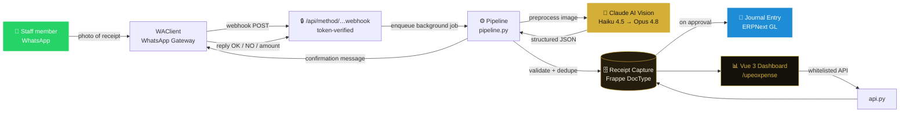
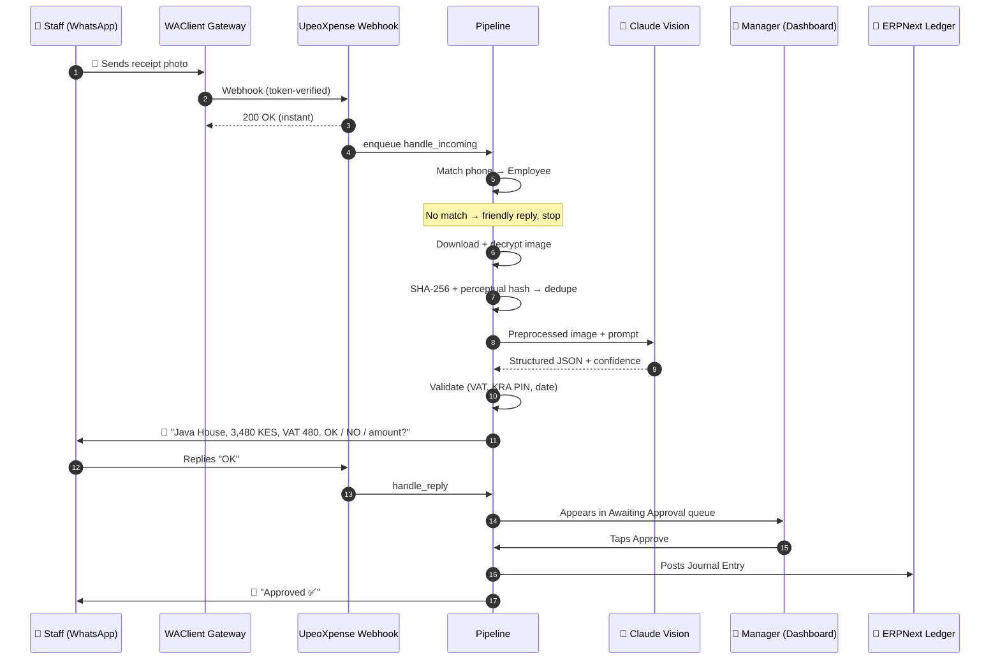
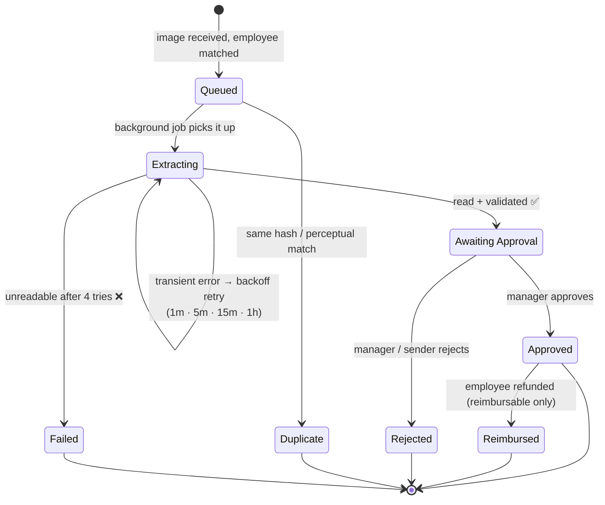
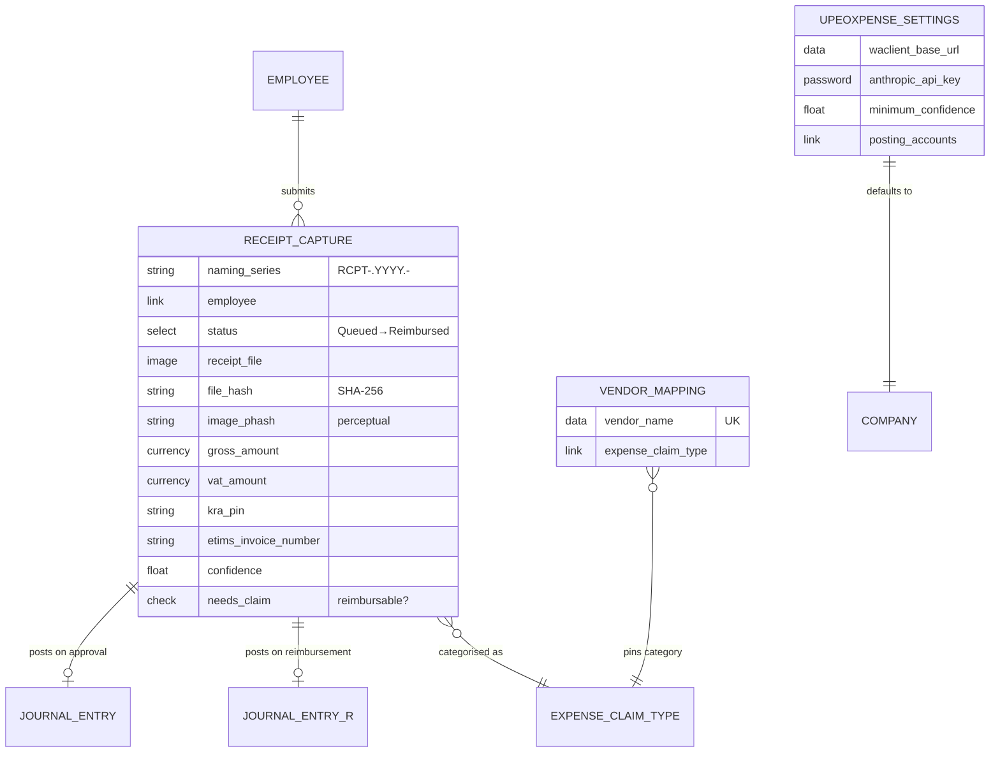
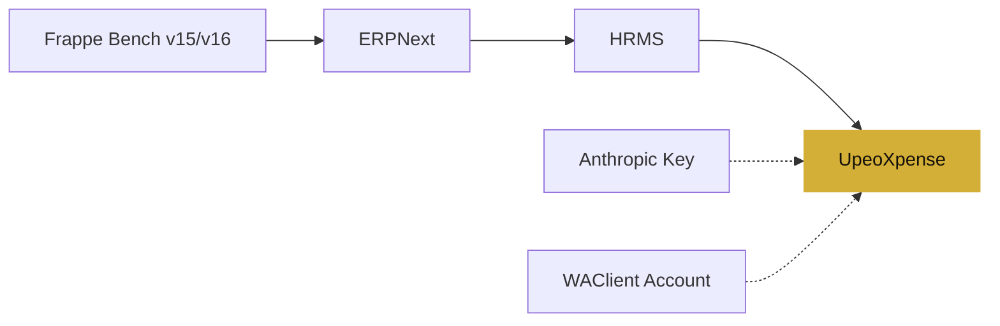
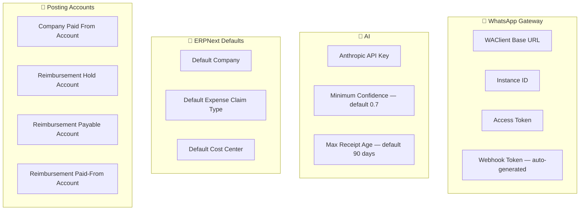
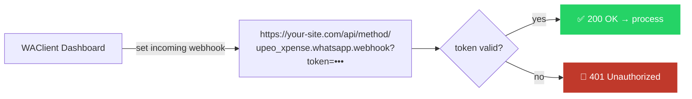
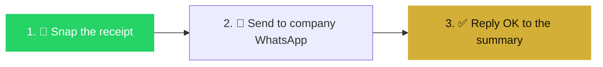
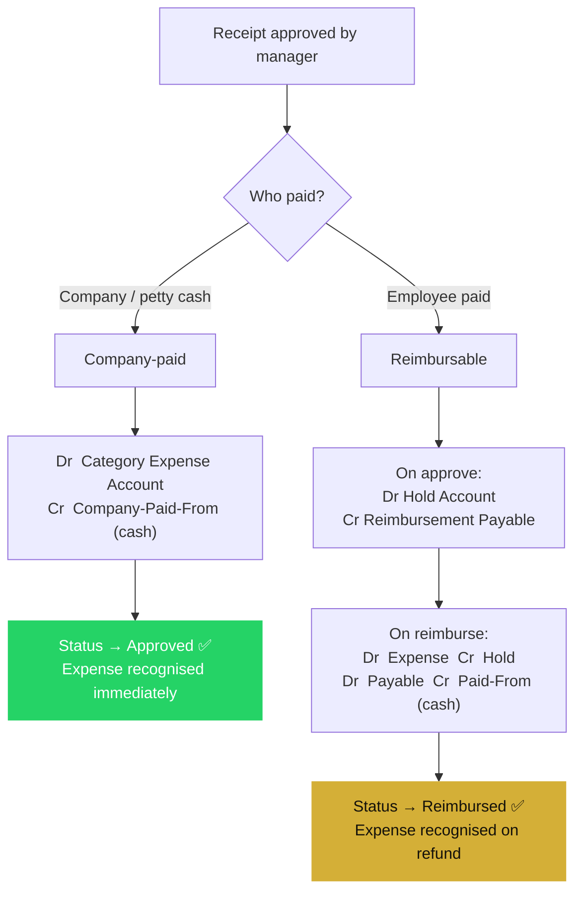

<p align="center">
  
</p>

<h1 align="center">UpeoXpense</h1>

<p align="center">
  <strong>Snap a receipt on WhatsApp. AI reads it. ERPNext files the expense — automatically.</strong>
</p>

<p align="center">
  WhatsApp-first expense management for <a href="https://frappe.io">Frappe</a> &amp; <a href="https://erpnext.com">ERPNext</a>, powered by Claude AI vision — for <strong>any</strong> business running ERPNext, anywhere in the world, with first-class support for Kenyan tax (KRA PIN, 16% VAT, eTIMS, M-Pesa).
</p>

<p align="center">
  
  
  
  
  
  
  
</p>

---

## 📖 Table of Contents

1. [What is UpeoXpense?](#-what-is-upeoxpense)
2. [Why UpeoXpense](#-why-upeoxpense)
3. [Key Features](#-key-features)
4. [How It Works](#-how-it-works-architecture)
5. [The WhatsApp Journey](#-the-whatsapp-journey-end-to-end)
6. [The Extraction Pipeline](#-the-extraction-pipeline)
7. [Data Model](#-data-model)
8. [Tech Stack](#-tech-stack)
9. [Prerequisites](#-prerequisites)
10. [Installation — Step by Step](#-installation--step-by-step)
11. [Configuration](#️-configuration)
12. [Connecting WhatsApp](#-connecting-whatsapp-waclient)
13. [Building the Web Dashboard](#-building-the-web-dashboard)
14. [Usage Guide](#-usage-guide)
15. [Accounting & Settlement Model](#-accounting--settlement-model)
16. [API Reference](#-api-reference)
17. [Testing](#-testing)
18. [Troubleshooting & FAQ](#-troubleshooting--faq)
19. [Security](#-security)
20. [Roadmap](#-roadmap)
21. [Contributing](#-contributing)
22. [Make It Yours: Adapt It to Your Stack](#-make-it-yours-adapt-it-to-your-stack)
23. [About Upeosoft](#-about-upeosoft)
24. [Further Reading](#-further-reading)
25. [License & Credits](#-license--credits)

---

## 🚀 What is UpeoXpense?

**UpeoXpense** is an open-source **WhatsApp expense-management app for Frappe and ERPNext**. It turns the phone everyone already carries into an effortless expense capture tool:

> A staff member takes a photo of a receipt, sends it to your company's WhatsApp number, and within seconds the expense is read by AI, logged against that employee, and waiting for a manager's one-tap approval — with the accounting already posted to the ledger.

No forms. No apps to install for staff. No lost paper receipts. No end-of-month reconciliation marathon.

UpeoXpense reads receipts with **Claude AI vision**, validates every field with plain, auditable Python (the AI never makes the decision — it only reads), and records the expense directly inside ERPNext where your accountants already work. A clean, gold-on-charcoal **Vue 3 dashboard** at `/upeoxpense` gives managers a real-time view of spend, an approval queue, category mapping, and settings.

It works for **any organisation running ERPNext**, anywhere in the world — and ships with real Kenyan finance workflows built in: **KRA PIN** validation, **16% VAT**-inclusive maths, **eTIMS** invoice numbers, and **M-Pesa** as a first-class payment method (none of them a hard requirement). And the stack is swappable: a different AI model, a different WhatsApp gateway, even a different back-office system — see [Make It Yours](#-make-it-yours-adapt-it-to-your-stack). Built by **[Upeosoft Limited](https://upeosoft.com)**, the team behind **[upeo.ai](https://upeo.ai)**.

---

## 💡 Why UpeoXpense

| The old way 😮‍💨 | With UpeoXpense ✨ |
|---|---|
| Staff hoard paper receipts for weeks | Receipts captured the moment they're issued |
| Manual data entry into spreadsheets | AI reads vendor, date, amount, VAT & tax IDs |
| Expense apps nobody wants to install | Uses **WhatsApp** — zero learning curve |
| Duplicate & fraudulent claims slip through | SHA-256 + perceptual-hash **duplicate detection** |
| Reconciliation at month-end | Ledger postings happen **on approval** |
| Data lives outside your ERP | Native **Frappe / ERPNext** doctypes & GL |

---

## ✨ Key Features

- 📲 **WhatsApp capture** — staff just send a photo. No app, no login, no training.
- 🤖 **AI vision extraction** — reads vendor, date, gross amount, VAT, KRA PIN, eTIMS number, receipt number, line items, payment method & category using **Claude Haiku 4.5**, escalating to **Claude Opus 4.8** when confidence is low.
- 🧮 **Deterministic validation** — AI returns *data*; auditable Python decides. VAT is checked against a 16% VAT-inclusive computation, KRA PINs against `^[A-Z]\d{9}[A-Z]$`, dates against a configurable age window.
- 🛡️ **Duplicate & fraud guards** — exact **SHA-256** file hashing plus a **64-bit perceptual hash (dHash)** that survives WhatsApp re-compression, backed by cross-field checks on invoice numbers, amounts and vendors.
- ✅ **Conversational confirmation** — the sender replies `OK` to confirm, `NO` to cancel, `CLAIM` to request reimbursement, or just types a number to correct the amount.
- 👔 **Manager approval queue** — one-tap approve, reject, correct or reimburse from a web dashboard.
- 📊 **Real-time analytics** — captured value, spend trend, top vendors, category split, pending reimbursements — all live.
- 🧾 **Automatic ledger postings** — company-paid (petty cash) and employee-reimbursable expenses each post correct **Journal Entries** to ERPNext.
- 🔁 **Self-healing retries** — transient AI/network failures back off gracefully (1m → 5m → 15m → 1h) via a per-minute scheduler.
- 🌍 **Works anywhere, Kenya built-in** — runs for any ERPNext company and currency; KRA PIN, 16% VAT, eTIMS and M-Pesa ship as first-class features, not a hard requirement.
- 🧩 **Swappable stack** — a different AI model, a different WhatsApp gateway, or even a different back-office system? The pipeline is layered so the pieces can be changed — see [Make It Yours](#-make-it-yours-adapt-it-to-your-stack).

---

## 🏗 How It Works (Architecture)



**Three moving parts:**

1. **Inbound webhook** (`whatsapp.py`) — receives WhatsApp events from WAClient, verifies a shared token, and returns `200 OK` instantly, handing the real work to a background job. Slow work never blocks the webhook.
2. **The pipeline** (`pipeline.py`) — the brain. Downloads and decrypts the image, preprocesses it, calls Claude, validates, de-duplicates, stores the `Receipt Capture`, and posts the accounting on approval.
3. **The dashboard** (`api.py` + Vue SPA) — a standalone Vue 3 app served at `/upeoxpense` that talks to whitelisted Frappe methods for managers to review, approve and analyse.

---

## 📲 The WhatsApp Journey (End to End)



**What the staff member experiences** — one photo, one reply. That's the entire workload for the person spending the money.

> 📖 **Related read:** [*A WhatsApp assistant for a retail counter — what we built and what we learned*](https://upeo.ai/blog/retail-whatsapp-assistant-case-study) on the [upeo.ai](https://upeo.ai) blog, on turning WhatsApp into a real business channel.

**The reply grammar:**

| Reply | Meaning |
|---|---|
| `OK`, `YES`, `SAWA`, `1` | Confirm — send to the approval queue |
| `NO`, `CANCEL`, `2` | Withdraw the expense |
| `CLAIM`, `REIMBURSE`, `REFUND`, `3` | Mark as employee-paid, request reimbursement |
| `3480` or `3,480` or `KES 3480` | Correct the amount, then re-validate |

---

## 🔬 The Extraction Pipeline

Each receipt flows through a small state machine. Statuses are visible on every `Receipt Capture` record, so nothing is ever a black box.



**Under the hood, in order:**

1. **Ingest** — download media (decrypting WhatsApp end-to-end encrypted `.enc` payloads via HKDF + AES-256-CBC), compute `SHA-256` and a 64-bit `dHash`, reject duplicates early.
2. **Preprocess** — Pillow: auto-orient (EXIF), convert to RGB, auto-contrast, resize to fit 1500×1500 (LANCZOS), re-encode JPEG q85. The original file is never modified.
3. **Extract** — send the image + a strict JSON-only prompt to **Claude Haiku 4.5**. If the result is unparseable, low-confidence, or missing the amount/date, retry once with **Claude Opus 4.8**.
4. **Validate** — plain Python produces human-readable warnings (never blocks): amount > 0, VAT ≈ `gross × 0.16 / 1.16`, date not future / not too old, KRA PIN pattern.
5. **De-duplicate (semantic)** — a second guard on invoice numbers, amounts and fuzzy vendor names catches re-sends that slipped past the hash check.
6. **Log & confirm** — create the `Receipt Capture`, resolve its category (Vendor Mapping → AI suggestion → default), and WhatsApp the sender for confirmation.

> **Design principle:** *Claude never makes a decision.* It returns data and a confidence score; auditable Python decides what happens next. The verbatim AI response is always stored on the record for traceability.

> 📖 **See the idea in action:** [*"I gave it a photo of a handwritten delivery note. Watch."*](https://upeo.ai/blog/photo-of-a-delivery-note-watch) walks through the same photo-to-structured-data extraction UpeoXpense uses for receipts, and [*Putting AI on your own documents without it making things up*](https://upeo.ai/blog/rag-on-your-documents) explains the read-don't-decide philosophy behind it.

---

## 🗄 Data Model



| DocType | Purpose |
|---|---|
| **Receipt Capture** | The heart of the app — one record per receipt. It *is* the expense record (petty-cash model), holding the image, extracted data, status, confidence, and links to any Journal Entries. |
| **UpeoXpense Settings** *(Single)* | All configuration: WAClient credentials, Anthropic key, default company/category/cost-centre, confidence threshold, receipt age limit, and the four posting accounts. |
| **Vendor Mapping** | Pins a vendor name to a fixed category so manual corrections stick permanently. |

---

## 🧰 Tech Stack

| Layer | Technology |
|---|---|
| **Framework** | Frappe v15 / v16 · ERPNext · HRMS (required apps) |
| **Language** | Python 3.10+ |
| **AI** | Anthropic Claude — Haiku 4.5 (first pass) → Opus 4.8 (retry) |
| **Messaging** | WhatsApp via [WAClient](https://waclient.com) gateway (Baileys events) |
| **Image** | Pillow (preprocess) · `cryptography` (WhatsApp media decryption) |
| **Frontend** | Vue 3 (`<script setup>`), no router/store — one lean bundle built by Frappe/esbuild |
| **HTTP** | `requests` |
| **Packaging** | `flit_core`, `ruff` |

---

## 📋 Prerequisites

Before installing, you'll need:

- ✅ A working **[Frappe Bench](https://github.com/frappe/bench)** (v15 or v16) with **ERPNext** and **HRMS** installed.
- ✅ A site with at least one **Company** configured in ERPNext, and **Employees** whose *Preferred Contact Number* matches their WhatsApp number.
- ✅ An **[Anthropic API key](https://console.anthropic.com)** (for Claude vision).
- ✅ A **[WAClient](https://waclient.com)** account with an instance ID and access token (your WhatsApp gateway).
- ✅ A publicly reachable HTTPS URL for your site (so WAClient can deliver webhooks).



---

## 📦 Installation — Step by Step

### 1. Fetch the app into your bench

```bash
cd ~/frappe-bench
bench get-app https://github.com/Upeosoft-Limited/upeoXpense
```

### 2. Make sure ERPNext and HRMS are installed on your site

UpeoXpense depends on both (`required_apps = ["erpnext", "hrms"]`):

```bash
bench --site your-site.local install-app erpnext
bench --site your-site.local install-app hrms
```

### 3. Install UpeoXpense

```bash
bench --site your-site.local install-app upeo_xpense
```

On install, UpeoXpense automatically:
- 🔑 generates a secure 24-character **webhook token**,
- 📇 creates a **"Receipts This Month"** number card, and
- 🧭 sets up the **UpeoXpense** workspace.

### 4. Build assets and restart

```bash
bench build --app upeo_xpense
bench --site your-site.local migrate
bench restart
```

### 5. Enable the scheduler

The retry poller needs Frappe's scheduler running (it usually is in production):

```bash
bench --site your-site.local enable-scheduler
```

✅ **You're installed.** Next, configure it.

---

## ⚙️ Configuration

Open **UpeoXpense Settings** (Desk → search "UpeoXpense Settings") or the **Settings** tab in the `/upeoxpense` dashboard, and fill in:



| Setting | Description |
|---|---|
| **WAClient Base URL** | Usually `https://waclient.com`. |
| **WAClient Instance ID / Access Token** | From your WAClient dashboard. |
| **Webhook Token** | Auto-generated; used to authenticate incoming webhooks. |
| **Anthropic API Key** | Your Claude key (stored encrypted). |
| **Minimum Confidence** | Below this, the pipeline escalates to the stronger model. Default `0.7`. |
| **Maximum Receipt Age (days)** | Receipts older than this are flagged. Default `90`. |
| **Default Company / Expense Claim Type / Cost Center** | ERPNext defaults used when a receipt can't be auto-mapped. |
| **Posting accounts** | The four GL accounts that drive settlement (see [Accounting](#-accounting--settlement-model)). |

> 🔒 Secrets (access token, API key) are stored as encrypted `Password` fields and are **never** returned by the API — only a `…_set` boolean flag.

---

## 🔗 Connecting WhatsApp (WAClient)

Point your WAClient instance's **incoming webhook** at your site, appending the webhook token:

```
https://your-site.com/api/method/upeo_xpense.whatsapp.webhook?token=<your_webhook_token>
```

You'll find the exact, ready-to-copy URL in **UpeoXpense Settings** (and in the dashboard's Settings tab, with a copy button).



Test it end-to-end from **Settings → Test Connection**: enter a phone number and UpeoXpense sends a WhatsApp message through your gateway to confirm the credentials work.

> **Note:** WAClient forwards raw Baileys `messages.upsert` events and sends no signature, so UpeoXpense authenticates with your own shared token in the URL. The parser tolerates several payload shapes and handles ephemeral / view-once / edited messages and encrypted media.

---

## 🖥 Building the Web Dashboard

The Vue 3 SPA lives at **`/upeoxpense`** and is bundled by Frappe's built-in esbuild — there is **no separate `npm install`**. Source is in `upeo_xpense/public/js/upeoxpense/`; the entry point is `public/js/upeoxpense.bundle.js`.

```bash
# Rebuild after changing any .vue / .js file
bench build --app upeo_xpense

# Or, for live rebuilds during development
bench watch
```

Then visit `https://your-site.com/upeoxpense` (guests are redirected to log in first).

---

## 📱 Usage Guide

### For staff (the whole job)



1. **Snap** a photo of the receipt.
2. **Send** it to your company's WhatsApp number.
3. **Reply** to the summary UpeoXpense sends back:
   - `OK` to confirm,
   - a **number** to fix the amount,
   - `CLAIM` if *you* paid and want reimbursement,
   - `NO` to cancel.

That's it. No app, no login, no spreadsheet.

### For managers (the dashboard)

Visit **`/upeoxpense`**:

- **Overview** — captured value, this month's spend, awaiting approval, needs-attention, pending reimbursements, spend trend, top vendors and category split, live.
- **Expenses** — the approval queue. Open a receipt to see the original image and every extracted field, then **Approve**, **Reject**, **Correct** the amount, or mark it for **Reimbursement**.
- **Expense Claims** — review and act on linked ERPNext Expense Claims.
- **Categories** *(managers)* — map categories to GL accounts and create new expense ledgers.
- **Settings** *(admins)* — everything from [Configuration](#️-configuration), plus the test-connection tool.

---

## 💰 Accounting & Settlement Model

UpeoXpense treats the **Receipt Capture as the expense record itself** (many receipts are petty-cash), and posts real **Journal Entries** to ERPNext on approval — no manual bookkeeping.

There are two settlement paths:



- **Company-paid (petty cash)** — recognised immediately on approval:
  `Dr` category expense account · `Cr` company-paid-from (cash).
- **Reimbursable (employee paid)** — parked in a hold on approval, and only becomes an expense once the employee is refunded:
  - *approve:* `Dr` hold · `Cr` reimbursement payable
  - *reimburse:* `Dr` expense · `Cr` hold *(recognise)* **and** `Dr` payable · `Cr` paid-from cash *(refund)*.

Entries post on the **approval date** (not the receipt date) to avoid closed fiscal periods, and every receipt links to its Journal Entry for a clean audit trail.

> 📖 **Related read:** [*Connecting Payments to Your Accounting System So the Ledger Updates Itself*](https://upeosoft.com/insights/connect-payments-to-accounting-erp) — the same automate-the-ledger philosophy that drives UpeoXpense's postings.

---

## 🔌 API Reference

All endpoints are whitelisted Frappe methods under `upeo_xpense.api.*`, permission-checked server-side, consumed by the Vue SPA. Reads via `GET`, writes via `POST` with a CSRF token.

| Endpoint | Method | Purpose |
|---|---|---|
| `bootstrap` | GET | Current user, roles, capabilities, company & currency. |
| `dashboard` | GET | All KPIs, trends, vendor/category splits, recent activity. |
| `receipts` | GET | Paginated receipts (status filter + search). |
| `receipt` | GET | One receipt with image, fields, validation & permissions. |
| `receipt_action` | POST | `approve` · `reject` · `reimburse` · `correct`. |
| `claims` / `claim` | GET | ERPNext Expense Claims list / detail. |
| `claim_action` | POST | Approve / reject an Expense Claim. |
| `settings_get` / `settings_save` | GET/POST | Read & write settings (secrets write-only). |
| `test_connection` | POST | Send a test WhatsApp message. |
| `expense_categories` | GET | Categories with mapped GL accounts. |
| `expense_category_save` / `_delete` | POST | Manage categories (guarded delete). |
| `expense_account_create` | POST | Create a new expense ledger account. |

---

## 🧪 Testing

The app ships with unit and pipeline tests:

```bash
bench --site your-site.local run-tests --app upeo_xpense
```

Tests cover the validators (VAT/KRA/date logic), pipeline units, and the extraction flow.

---

## 🩺 Troubleshooting & FAQ

<details>
<summary><strong>A staff member sent a receipt but nothing happened.</strong></summary>

Their WhatsApp number must match an **Active Employee's** contact number in ERPNext. UpeoXpense normalises `+254`, `0`, and bare formats, but if there's no match it replies and stops. Check the Employee's *Preferred Contact Number*.
</details>

<details>
<summary><strong>The webhook returns 401 Unauthorized.</strong></summary>

The `?token=` in your WAClient webhook URL doesn't match the **Webhook Token** in UpeoXpense Settings. Copy it again from the Settings page (or dashboard).
</details>

<details>
<summary><strong>Receipts get stuck in "Extracting".</strong></summary>

That's the retry backoff (1m → 5m → 15m → 1h) doing its job during transient AI/network errors. Ensure the **scheduler is enabled** (`bench enable-scheduler`) so `retry_due_extractions` runs each minute. After 4 attempts the receipt is marked **Failed** and the sender is notified.
</details>

<details>
<summary><strong>"Category is not mapped to an account."</strong></summary>

Before an expense can post to the ledger, its category (Expense Claim Type) needs a GL account for the company. Map it on the **Categories** page in the dashboard.
</details>

<details>
<summary><strong>Does the AI decide whether to approve or pay?</strong></summary>

No. Claude only *reads* the receipt and returns data with a confidence score. Every decision — validation, duplicate detection, approval, posting — is deterministic Python or a human. The raw AI response is stored verbatim for audit.
</details>

<details>
<summary><strong>Which currencies and countries are supported?</strong></summary>

Currency defaults to **KES** and Kenyan tax features (KRA PIN, 16% VAT, eTIMS, M-Pesa) are first-class, but the core capture → validate → approve → post flow works with any ERPNext company and currency. For the tax context, see [*eTIMS vs Manual KRA Filing: What You Need to Know in 2026*](https://upeosoft.com/insights/etims-vs-manual-kra-filing).
</details>

<details>
<summary><strong>Do staff need to install anything?</strong></summary>

No. Staff only use **WhatsApp**. The dashboard is for managers and admins.
</details>

---

## 🔐 Security

- **Webhook auth** — a shared secret token (not a provider signature, which WAClient doesn't offer) gates every incoming webhook; mismatches get `401`.
- **Secrets at rest** — the Anthropic key and WAClient token are encrypted `Password` fields, never returned by any API.
- **Permission-checked API** — all reads use `frappe.get_list`, which enforces Frappe's role permissions; no endpoint bypasses them. Approvals require an approver role.
- **Duplicate & re-send defence** — SHA-256 + perceptual hashing + semantic cross-checks reduce duplicate and fraudulent submissions.
- **Fast, non-blocking webhook** — the handler returns immediately and processes in a background job, limiting exposure to slow-loris-style abuse.

---

## 🗺 Roadmap

- [ ] Multi-language confirmation messages (Swahili, French)
- [ ] Configurable approval workflows & thresholds
- [ ] Mileage & per-diem capture
- [ ] Additional WhatsApp gateways (Meta Cloud API)
- [ ] Exportable audit reports

Have an idea? [Open an issue](https://github.com/Upeosoft-Limited/upeoXpense/issues).

---

## 🤝 Contributing

Contributions are welcome!

1. Fork the repo and create a feature branch.
2. Follow the existing style (`ruff` is configured — tabs, double quotes, 110 cols).
3. Add or update tests.
4. Open a pull request describing the change.

```bash
# lint
ruff check .
# format
ruff format .
```

---

## 🧩 Make It Yours: Adapt It to Your Stack

UpeoXpense ships wired to a sensible default stack — **ERPNext**, **Claude** vision, and the **WAClient** WhatsApp gateway — but none of that is locked in. The pipeline is deliberately layered so each piece can be swapped:

- **🔄 Other systems, not just ERPNext.** The same *capture → read → validate → post* pattern works against other ERPs and line-of-business systems — accounting suites, POS platforms, custom back-offices. Not on ERPNext? [Upeosoft](https://upeosoft.com) can build the same flow into the system you already run.
- **🧠 A different AI provider.** Extraction is isolated behind a small model layer (today: Claude Haiku 4.5 → Opus 4.8). Prefer OpenAI, Google Gemini, an open-weights model, or an on-prem / self-hosted setup for data sovereignty? That's a contained change — talk to [upeo.ai](https://upeo.ai).
- **💬 A different WhatsApp — or a different channel entirely.** All messaging lives behind two functions (`send_text` / `parse_webhook`), so WAClient can be replaced with the **Meta WhatsApp Cloud API**, **Twilio**, or another gateway — or extended to **Telegram, SMS or email** — without touching the pipeline.
- **🛠 Your own rules & workflows.** Approval thresholds, category logic, country-specific tax rules, extra validations, custom dashboards and reports — all fair game.

> **Want a variation of this for your business?** Whatever your stack, **[Upeosoft](https://upeosoft.com) / [upeo.ai](https://upeo.ai) can set it up for you** — a different AI, a different messaging channel, or the whole capture-to-ledger flow on a different system. [Get in touch](https://upeo.ai/strategy-session), or start with a free [ERPNext health check](https://audit.upeo.ai).

---

## 🏢 About Upeosoft

UpeoXpense is built by **[Upeosoft Limited](https://upeosoft.com)** — a Kenyan software and automation company that builds the systems that run real businesses: custom software, **ERPNext implementation & support**, and practical AI automation for dealerships, clinics, schools and factories. Upeosoft is also the team behind **[upeo.ai](https://upeo.ai)**, an AI platform that connects to your communications, workflows and business data and handles the work that slows teams down — securely, accurately, around the clock.

If UpeoXpense is useful to you, here's where to go next:

- 🌐 **[upeosoft.com](https://upeosoft.com)** — custom software, ERPNext & business integrations (M-Pesa, Shopify, WhatsApp, APIs)
- 🤖 **[upeo.ai](https://upeo.ai)** — AI agents and copilots that run *inside* your systems
- 🩺 **[UpeoAudit](https://audit.upeo.ai)** — a free ERPNext health assessment

---

## 📚 Further Reading

More on the ideas behind UpeoXpense, from the [Upeosoft](https://upeosoft.com/insights) and [upeo.ai](https://upeo.ai/blog) blogs — all written by Karani Geoffrey:

**AI reading real-world documents**
- [*"I gave it a photo of a handwritten delivery note. Watch."*](https://upeo.ai/blog/photo-of-a-delivery-note-watch) — the same photo-to-structured-data idea UpeoXpense uses for receipts.
- [*Putting AI on your own documents without it making things up*](https://upeo.ai/blog/rag-on-your-documents) — why UpeoXpense lets AI **read** but never **decide**.
- [*What it looks like when AI runs inside the system*](https://upeo.ai/blog/what-it-looks-like-when-ai-runs-inside-the-system) — AI embedded in the ERP, not bolted on.

**WhatsApp as a business channel**
- [*A WhatsApp assistant for a retail counter: what we built and what we learned*](https://upeo.ai/blog/retail-whatsapp-assistant-case-study)

**Kenyan finance, tax & the ledger**
- [*eTIMS vs Manual KRA Filing: What You Need to Know in 2026*](https://upeosoft.com/insights/etims-vs-manual-kra-filing) — the KRA/eTIMS context behind UpeoXpense's validation.
- [*Connecting Payments to Your Accounting System So the Ledger Updates Itself*](https://upeosoft.com/insights/connect-payments-to-accounting-erp) — the philosophy behind UpeoXpense's automatic Journal Entries.
- [*How to Automatically Record M-Pesa Payments from the Confirmation SMS*](https://upeosoft.com/insights/record-mpesa-payments-from-sms)
- [*How to Reconcile M-Pesa Till Payments Without Daraja API Access*](https://upeosoft.com/insights/reconcile-till-payments-without-daraja)

**Thinking about AI for your business?**
- [*Where to actually start with AI in your business*](https://upeo.ai/blog/getting-started-with-ai)
- [*Before you pay anyone for AI, check these six things*](https://upeo.ai/blog/six-things-to-check-before-you-pay-for-ai)

---

## 📄 License & Credits

**UpeoXpense** is released under the **MIT License** — see [license.txt](license.txt).

Built and maintained by **Karani Geoffrey**, Founder & CEO of **[Upeosoft Limited](https://upeosoft.com)** — maker of **[upeo.ai](https://upeo.ai)**.

- 🌐 Web — [upeosoft.com](https://upeosoft.com) · [upeo.ai](https://upeo.ai)
- 📧 Email — [hello@upeo.ai](mailto:hello@upeo.ai)
- 🩺 Free ERPNext health check — [UpeoAudit](https://audit.upeo.ai)

<p align="center">
  <sub>Made in 🇰🇪 Kenya · Snap a receipt on WhatsApp, and let ERPNext do the rest.</sub>
</p>

<p align="center">
  <a href="#upeoxpense">⬆ Back to top</a>
</p>
